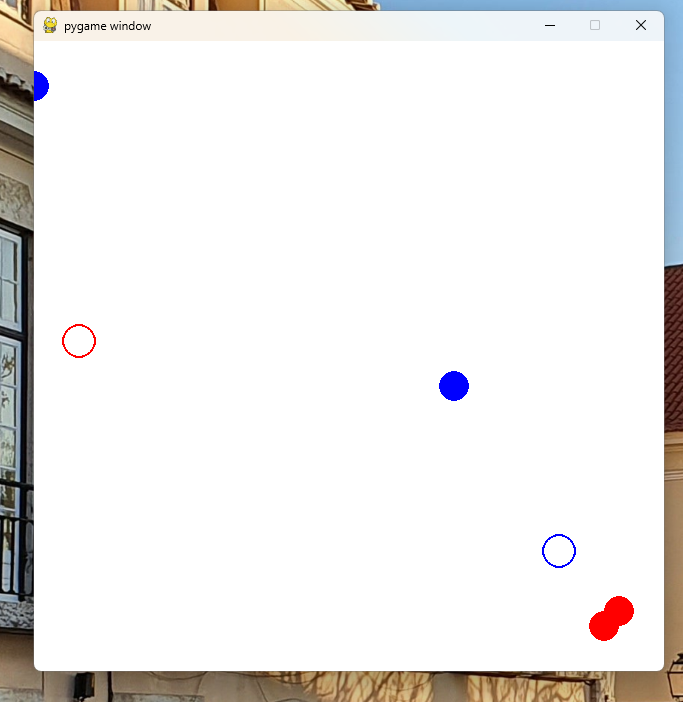
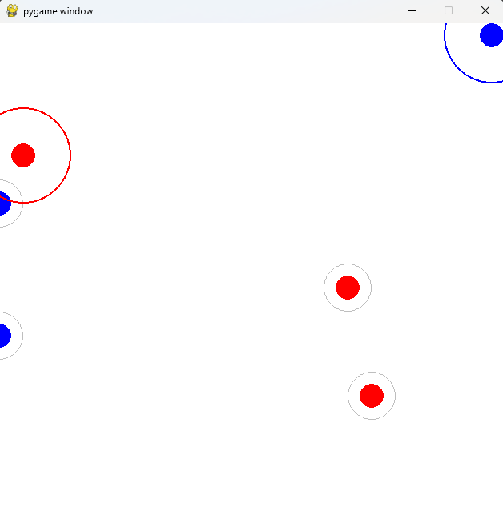

# CaptureTheFlag

## Notes and findings

* TODO explain why QMIX
* Had a problem with the environment observation (could only use Box with new API)
* Had a problem with forward (Problem 1: https://discuss.ray.io/t/confusion-migrating-to-new-api/21783)
* TODO maybe also evaluate ray tune against algo.train()?


1. Problem: Agents learned to stick to the top, change reward structure:

In general agents sticked to areas where punishment was low (e.g. on the edge of the map just moving left right to minimize punishment), therefore I had to punish them if delta was zero
2. I then implemented different policies for each team because it seamed with the shared policies the agents agreed to a "stalemate" to minimize loss for each other because no flag was capture. Also maybe corners are local optimum?
3. Introduce more reward for closing in on the enemy flag, higher entropy to encourage exploration, more reward for capturing the flag.
4. Time penalty too large relative to movement reward: -0.01 per step. The corner behavior makes perfect sense: the agents learned that doing nothing loses less reward than random wandering!
5. Add penalty for hitting the edge of the playing field.

Example with corner:


ppo_v3 --> good example for reward hacking
agents where going to the flag and stopped at a break even where going forward
brought more reward than going away to the flag
Then they started to wiggle back and forth. Sometimes one agent went to the flag while one was staying behind
reward hacking.
```
if delta_distance > 0:
    # reward += delta_distance * (1 / (dist + 0.1))
    reward += delta_distance
else:
    reward += delta_distance * 0.2
```

Then I tried no penalty for moving away from enemy flag to reduce agents fleeing to corners out of fear from penalties.

Then agents just went to the other side of the map and then standing still -> time penalty was too low.
Also still reward hacking -> I moved to only sparse rewards as suggested in the [paper](https://arxiv.org/pdf/2311.16339)



I encountered a bug that merged all observations into one which made agents essentially blind. But a cooperative behaviour emerged.
Why This Causes Corner/Border Behavior
When agents can't see meaningful patterns:

Random exploration dominates - they wander randomly
Corners/edges are "stable" - fewer random collision with invisible entities
Boundary behavior emerges - walls provide consistent feedback (can't move further)
Accidental captures are pure luck - even though you see them in logs, agents can't learn why they happened


PPO quickly learns:
“Moving doesn’t reliably improve return — staying still doesn’t hurt.”
Once that gradient direction appears once, PPO’s clipping + entropy decay locks it in.