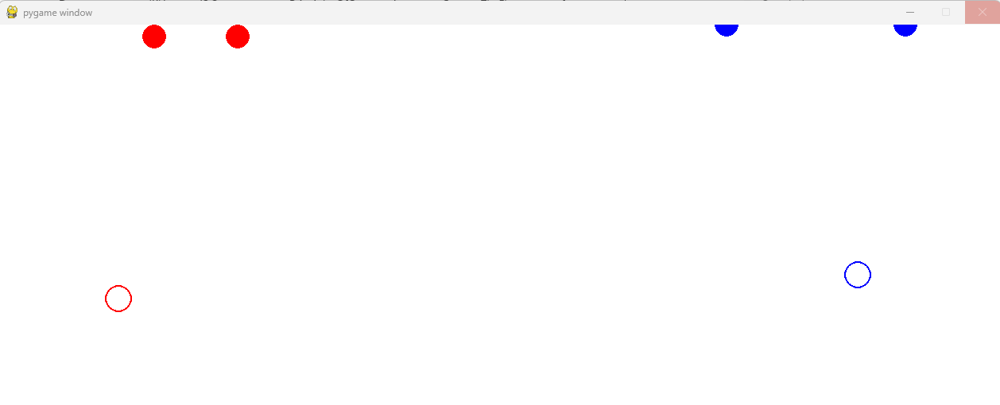

# CaptureTheFlag

## Notes and findings

* TODO explain why QMIX
* Had a problem with the environment observation (could only use Box with new API)
* Had a problem with forward (Problem 1: https://discuss.ray.io/t/confusion-migrating-to-new-api/21783)
* TODO maybe also evaluate ray tune against algo.train()?

1. Problem: Agents learned to stick to the top, change reward structure:
